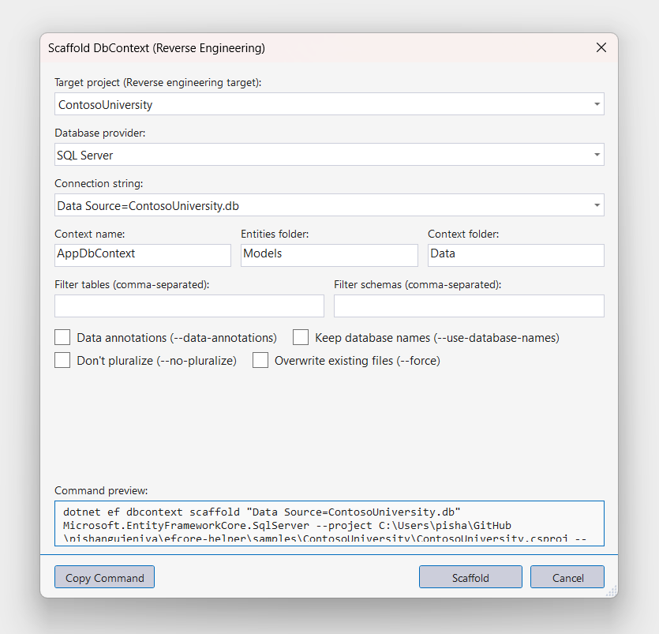
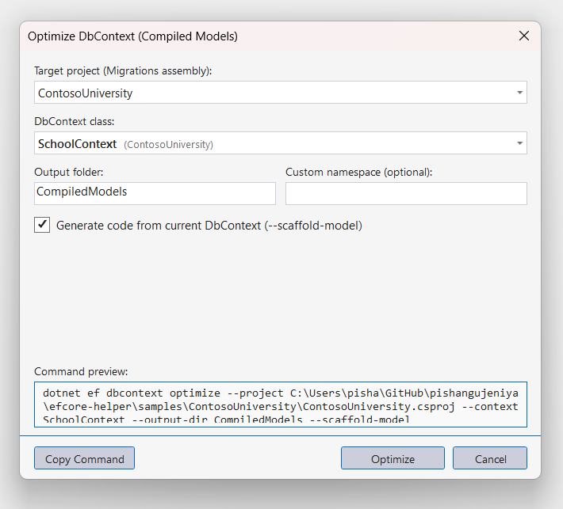

<p align="center">
  
</p>

<h1 align="center">EF Core Helper for Visual Studio</h1>

<p align="center">
  <strong>The first-class Entity Framework Core GUI and management experience — built natively for Visual Studio.</strong>
</p>

<p align="center">
  <a href="https://github.com/pishangujeniya/efcore-helper/actions/workflows/build.yml"></a>
  <a href="https://github.com/pishangujeniya/efcore-helper/releases"></a>
  
  
  <a href="LICENSE"></a>
</p>

<p align="center">
  
</p>

---

## 💡 Why EF Core Helper?

Entity Framework Core is essential for modern .NET applications, yet managing migrations has traditionally required memorizing obscure command line flags or using the ancient Package Manager Console:
- Manually typing repetitive `--project` and `--startup-project` paths every time.
- Leaving the visual design environment to execute commands in a separate terminal.
- Guessing CLI arguments and options without immediate validation or preview.

**EF Core Helper modernizes your EF Core developer experience.** It provides a comprehensive, visual management suite built directly into Visual Studio, specifically tailored for modern **.NET Core / .NET 6+ / 8+ / 9+ / 10+** projects:
- Visual, structured dialogs with **Interactive Live Command Previews**.
- One-click migration generation, database updates, rollbacks, and idempotent scripts.
- Automatic solution scanning for DbContexts, projects, and connection strings.
- Real-time execution logs with color-coded status, copy output, and cancellation controls.

---

## ⚡ Feature Highlights

| Feature | Package Manager Console (PMC) | **EF Core Helper (This Extension)** |
| :--- | :---: | :---: |
| **Dedicated EF Core Tool Window** | ❌ | ✅ |
| **Live `dotnet ef` Command Preview** | ❌ | ✅ |
| **Add / Remove Migration Dialogs** | ❌ (CLI / PMC only) | ✅ |
| **Update Database with Target Picker** | ❌ (CLI / PMC only) | ✅ |
| **Scaffold DbContext (Database First UI)** | ❌ | ✅ |
| **Generate Idempotent SQL Scripts UI** | ❌ | ✅ |
| **Create Migration Executable Bundles** | ❌ | ✅ |
| **Drop Database Safety Dialog** | ❌ | ✅ |
| **Optimize DbContext (Compiled Models)** | ❌ | ✅ |
| **Real-Time Streaming Console with Stop/Cancel** | ❌ | ✅ |
| **Automatic `dotnet-ef` Global Tool Detection** | ❌ | ✅ (with 1-Click Install & Update) |
| **VS Dark / Light / Blue Theme Adaptive** | ⚠️ Partial | ✅ 100% Native Themed |

---

## ✨ Key Features

### 1. 🗂️ Dedicated Entity Framework Core Tool Window
- **Context Selectors**: Pick your Target Project, Startup Project, and `DbContext` from clean dropdowns that automatically scan your solution.
- **Project Filter**: Exclusively focuses on modern .NET Core / .NET SDK projects (filtering out legacy .NET Framework noise).
- **Migration History Explorer**: Browse all migrations in your project sorted latest-first with timestamp, ID, and right-click actions (*"Update database to here"*, *"Script from here"*).
- **Tooling Status Banner**: Automatically detects if `dotnet` and `dotnet-ef` are installed and checks NuGet for newer tool releases, with 1-click **Install dotnet-ef** or **Update dotnet-ef** buttons.

### 2. 🔍 Interactive Live Command Preview
Every dialog includes a real-time command preview box that updates interactively as you type or toggle options:
```bash
dotnet ef migrations add InitialCreate --project MyApp.Data --startup-project MyApp.Web --context AppDbContext
```
Inspect the exact arguments before running, or click **Copy** to run it in your own terminal.

### 3. ➕ Add Migration Dialog
- Name validation ensuring valid C# identifiers.
- Target project and startup project selection.
- Output directory (`Migrations` default or custom path) and custom namespace override.
- Build bypass (`--no-build`) and verbose diagnostics (`--verbose`).

<p align="center">
  
</p>

### 4. ⚡ Update Database Dialog
- Pick from `<Latest> (Apply all pending)`, `0 (Revert all migrations)`, or any specific migration in your history.
- **Connection String Override**: Auto-populated from your project's `appsettings.json`, `appsettings.Development.json`, or enter custom connection strings.
- Target project and startup project pickers with automatic solution scanning.

<p align="center">
  
</p>

### 5. ↩️ Remove Last Migration Dialog
- Safely rollback and remove the most recently added migration before applying it to your database.
- **Force Removal** (`--force`): Forcefully revert the migration files even if already applied to a target database.
- Real-time command preview ensures complete transparency before deletion.

<p align="center">
  
</p>

### 6. 🏗️ DbContext Scaffolding Wizard (Database First)
- Quick presets for popular database providers:
  - **SQL Server** (`Microsoft.EntityFrameworkCore.SqlServer`)
  - **PostgreSQL** (`Npgsql.EntityFrameworkCore.PostgreSQL`)
  - **MySQL / MariaDB** (`Pomelo.EntityFrameworkCore.MySql`)
  - **SQLite** (`Microsoft.EntityFrameworkCore.Sqlite`)
  - **Oracle** (`Oracle.EntityFrameworkCore`)
  - **Azure Cosmos DB** (`Microsoft.EntityFrameworkCore.Cosmos`)
- Separate directories for generated entity models and DbContext.
- Filter by specific tables and schemas.
- Options for Data Annotations (`--data-annotations`), Database Names (`--use-database-names`), Force overwrite (`--force`), and Singularization (`--no-pluralize`).

<p align="center">
  
</p>

### 7. 📜 Generate Idempotent SQL Scripts
- Generate migration SQL scripts from any starting migration (`0 (Beginning of time)`) to a target migration (`<Latest>` or specific point in history).
- **Idempotent Script** (`--idempotent`): Generates scripts safe to run against any database regardless of current migration state.
- **Transaction Control** (`--no-transactions`): Allows disabling transaction wrapping for statements that cannot execute inside transactions.
- Interactive file browser to save the generated `.sql` file directly.

<p align="center">
  
</p>

### 8. 📦 Create Migration Executable Bundles
- Compile standalone deployment executables (`dotnet ef migrations bundle`) targeting any runtime (`win-x64`, `linux-x64`, `osx-arm64`).
- Self-contained bundle option (`--self-contained`) for environments without the .NET SDK installed.
- Force overwrite option (`--force`) to replace existing bundle binaries.

<p align="center">
  
</p>

### 9. 🗑️ Drop Database Safety Dialog
- Guarded safety dialog to drop development or test databases cleanly.
- **Dry Run Only** (`--dry-run`): Preview and test the drop command without destroying actual data.
- **Force Drop** (`--force`): Bypass interactive confirmation prompts.

<p align="center">
  
</p>

### 10. 🚀 Optimize DbContext (Compiled Models)
- Generate pre-compiled models (`dotnet ef dbcontext optimize`) to dramatically speed up DbContext startup times in production applications.
- Custom target output folder (default `CompiledModels`) and namespace specification.
- Option to scaffold code directly from the current model (`--scaffold-model`).

<p align="center">
  
</p>

### 11. 💻 Real-Time Execution Console
- Watch `dotnet ef` output stream in real time with syntax coloring.
- Visual execution state: **Ready** (gray), **Running** (yellow spinner), **Success** (green checkmark), **Failed** (red).
- **Stop / Cancel** button to kill the active process tree safely if an operation hangs.
- Simultaneous output to the Visual Studio **Output Window** (*"Entity Framework Core"* pane).

---

## 🚀 Installation & Getting Started

### Method 1: Install via Visual Studio Marketplace *(Coming Soon)*
1. Open Visual Studio 2022.
2. Go to **Extensions > Manage Extensions**.
3. Search for **EF Core Helper** and click **Download**.
4. Restart Visual Studio.

### Method 2: Manual VSIX Installation
1. Download `EFCoreHelper.vsix` from the [Releases](https://github.com/pishangujeniya/efcore-helper/releases) page.
2. Close all Visual Studio instances.
3. Double-click `EFCoreHelper.vsix` to install.

### Quick Start
1. Open any solution containing a .NET Core EF Core project.
2. Open the tool window:
   - Go to **Tools > EF Core Helper > EF Core Helper Tool Window**
   - Or press keyboard shortcut <kbd>Ctrl</kbd>+<kbd>Alt</kbd>+<kbd>E</kbd>, <kbd>M</kbd>
   - Or right-click any project in Solution Explorer > **EF Core Helper > Open EF Core Helper**
3. Select your project and DbContext, and start managing your migrations effortlessly!

---

## 🛠️ Building From Source

### Prerequisites
- Visual Studio 2022 (17.0+) with *.NET desktop development* and *Visual Studio extension development* workloads.
- .NET SDK (8.0+ or 10.0+).
- `dotnet-ef` global CLI tool (`dotnet tool install --global dotnet-ef`).

### Build Command
Clone the repository and run the automated build script:

```powershell
git clone https://github.com/pishangujeniya/efcore-helper.git
cd efcore-helper
.\build.ps1
```

The compiled and packaged extension will be placed in:
```
artifacts/EFCoreHelper.vsix
```

### Running Automated Tests
```bash
dotnet test
```

---

## 🚀 Deployment & Marketplace Publishing

Releases are automatically prepared via GitHub Actions (`release.yml`), and uploaded to the Visual Studio Marketplace.
For step-by-step instructions on triggering releases, downloading assets, and uploading packages, see the [Publishing Guide](PUBLISHING.md).

---

## 🤝 Contributing

We welcome contributions from the open-source community! Whether you want to report a bug, suggest a new feature, or submit a pull request, we'd love to have you onboard.

- Check out our [Contributing Guide](CONTRIBUTING.md) for details on development setup, debugging with the Experimental Instance (`/rootsuffix Exp`), and coding standards.
- Read our [Code of Conduct](CODE_OF_CONDUCT.md).
- Security disclosures should follow our [Security Policy](SECURITY.md).

---

## 📄 License

This project is licensed under the [MIT License](LICENSE).
Copyright &copy; 2026 Pishang Ujeniya.
